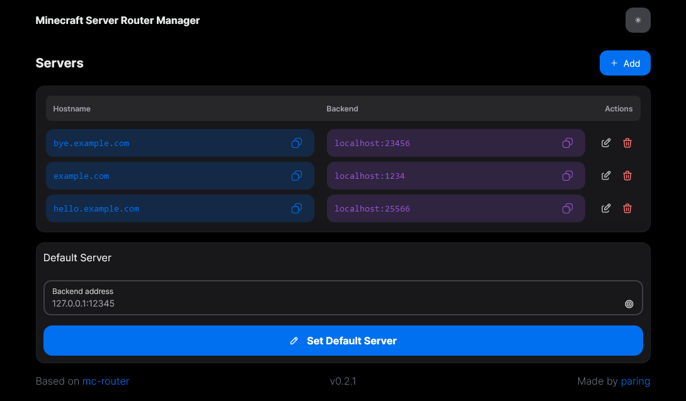

# MC Router Manager

Management web ui for [mc-router](https://github.com/itzg/mc-router)



## Installation

You can use docker image: `pikokr/mc-router-manager`

> **There's no authentication, so you should use proxy with authentication for exposing this application publically**

```shell
docker run -d -e API_URL=http://host:port -p 127.0.0.1:3000:3000 pikokr/mc-router-manager
```
